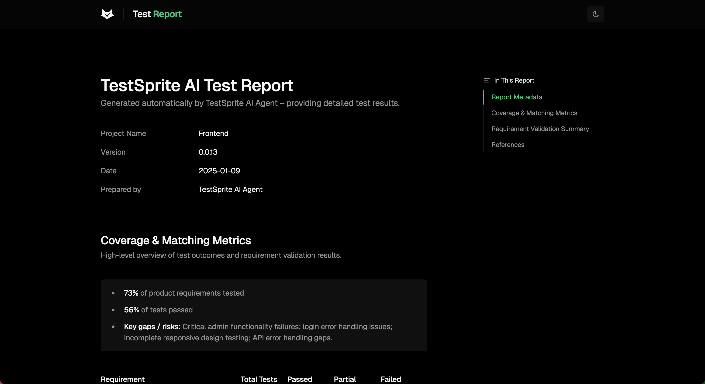

## 10-Minute Demo Video

Watch TestSprite MCP Server in action with this complete workflow demonstration:

<Frame>
  <iframe 
    width="100%" 
    height="400" 
    src="https://www.youtube.com/embed/yLQdORqPl3s" 
    frameBorder="0" 
    allow="accelerometer; autoplay; clipboard-write; encrypted-media; gyroscope; picture-in-picture" 
    allowFullScreen
    style={{ borderRadius: '8px'}}
  ></iframe>
</Frame>
<br />

**What you'll see in the demo:**
- Set up TestSprite MCP Server **directly inside Cursor**.
- See **end-to-end** testing workflow from start to finish
- Missing product requirements? MCP automatically **generates** them for you
- Full **test plans** and **test cases** created automatically
- Bugs **detected**, **reported**, and **resolved** with no human intervention in one loop
- Achieve **90%+** code accuracy with zero manual prompting

## E-commerce Frontend (React + TypeScript + Vite)

### Project Overview
Simple locally hosted e-commerce web application with product browsing, user authentication, and admin functionality.

**Tech Stack**
<Tabs>
  <Tab title="Frontend" icon="window-maximize">
     <Columns cols={3}>
       <Card title="React 18">
         <div style={{ display: 'flex', alignItems: 'flex-start', justifyContent: 'flex-start', paddingTop: '8px' }}>
           
         </div>
       </Card>
        <Card title="TypeScript">
         <div style={{ display: 'flex', alignItems: 'flex-start', justifyContent: 'flex-start', paddingTop: '8px' }}>
           
         </div>
       </Card>
       <Card title="Vite">
         <div style={{ display: 'flex', alignItems: 'flex-start', justifyContent: 'flex-start', paddingTop: '8px' }}>
           
         </div>
       </Card>
        <Card title="Material UI">
         <div style={{ display: 'flex', alignItems: 'flex-start', justifyContent: 'flex-start', paddingTop: '8px' }}>
           
         </div>
       </Card>
     </Columns>
  </Tab>
   <Tab title="Backend" icon="server">
       <Columns cols={3}>
        <Card title="Node.js (local development)">
          <div style={{ display: 'flex', alignItems: 'flex-start', justifyContent: 'flex-start', paddingTop: '8px' }}>
            
          </div>
        </Card>
      </Columns>
  </Tab>
     <Tab title="Testing" icon="gear">
       <Columns cols={3}>
        <Card title="Playwright (Python)">
          <div style={{ display: 'flex', alignItems: 'flex-start', justifyContent: 'flex-start', paddingTop: '8px' }}>
            
          </div>
        </Card>
      </Columns>
  </Tab>
</Tabs>

### Command Used
```text icon="file-lines"
Can you test this e-commerce project with TestSprite?
```

### Generated Normalized PRD Example
```json Expandable Sample Normalized PRD
{
  "meta": {
    "project": "Simple E-commerce Web Application",
    "version": "1.0.0",
    "date": "2025-07-01",
    "prepared_by": "Generated by TestSprite"
  },
  "product_overview": "A simple locally hosted e-commerce web application allowing users to browse products, purchase using a hardcoded test account, and manage orders with admin functionality for product management.",
  "core_goals": [
    "Enable users to browse a product catalog with detailed product views.",
    "Provide authentication with a hardcoded test user for purchasing and order tracking.",
    "Allow users to simulate purchases and view their order history.",
    "Support admin users to manage product listings via a CRUD interface.",
    "Run fully locally without reliance on external services or databases."
  ],
  "key_features": [
    "User login/logout with React Context API and route protection.",
    "Product catalog displaying products fetched from backend with images and details.",
    "Individual product detail pages with purchase functionality.",
    "Order history page showing user's past purchases.",
    "Admin dashboard for adding, editing, and deleting products.",
    "Simulated checkout process without real payment integration.",
    "... more 4 features"
  ],
  "user_flow_summary": [
    "Visitor accesses product catalog and browses available products.",
    "Visitor logs in using the test account credentials.",
    "Logged in user selects a product and clicks buy to simulate purchase.",
    "System adds the purchase to the user's order history.",
    "... more 3 user flows"
  ],
  "validation_criteria": [
    "Users can only log in successfully with the hardcoded test credentials.",
    "Unauthenticated users are redirected to login when accessing protected routes.",
    "Product catalog displays correct and complete product data fetched from backend.",
    "Purchasing updates order history and returns appropriate success or error feedback.",
    "... more 6 validation criteria"
  ],
  "code_summary": {
    "tech_stack": [
      "TypeScript",
      "React", 
      "Vite",
      "Material-UI",
      "React Router DOM",
      "CSS"
    ],
    "features": [
      {
        "name": "Authentication System",
        "description": "User login/logout functionality with React Context API for state management, includes test credentials and protected route handling",
        "files": ["src/App.tsx", "src/pages/Login.tsx"]
      },
      {
        "name": "Product Catalog",
        "description": "Display grid of products fetched from API with product cards showing images, names, categories, prices, and buy/view details buttons",
        "files": ["src/pages/ProductCatalog.tsx"]
      },
      "... more 10 features"
    ]
  }
}
```

### Generated Test Plan Example

```json Expandable Sample Test Cases
[
  {
    "id": "TC001",
    "title": "Login success with valid test credentials",
    "description": "Verify that users can log in successfully using the hardcoded test credentials",
    "category": "functional",
    "priority": "High",
    "steps": [
      {
        "type": "action",
        "description": "Navigate to the login page"
      },
      {
        "type": "action", 
        "description": "Input valid hardcoded username"
      },
      {
        "type": "assertion",
        "description": "Verify the user is redirected to the product catalog page"
      },
      "... more 3 steps"
    ]
  },
  {
    "id": "TC002",
    "title": "Login failure with invalid credentials",
    "description": "Verify that login is unsuccessful with invalid username or password",
    "category": "error handling",
    "priority": "High",
    "steps": ["... 6 action/assertion steps"]
  },
  {
    "id": "TC003",
    "title": "Redirect unauthenticated user from protected routes",
    "description": "Verify that unauthenticated users are redirected to login when trying to access protected routes",
    "category": "security", 
    "priority": "High",
    "steps": ["... 4 action/assertion steps"]
  },
  "... more 13 test cases"
]
```

**Categories Generated:**
<Columns cols={2}>
  <Card title="Functional (8 tests)">
  Core business logic and user workflows
  </Card>
  <Card title="Error Handling (3 tests)">
  Exception handling and error recovery
  </Card>
  <Card title="Security (3 tests)">
  Authentication, authorization, access control  
  </Card>
  <Card title="UI (2 tests)" >
  User interface interactions and responsive design
  </Card>
</Columns>

### Generated Test Code Example
```python Expandable Sample Test Code
# TC001_Login_success_with_valid_test_credentials.py
import asyncio
from playwright import async_api

async def run_test():
    pw = None
    browser = None
    context = None
    
    try:
        # Start a Playwright session in asynchronous mode
        pw = await async_api.async_playwright().start()
        
        # Launch a Chromium browser in headless mode with custom arguments
        browser = await pw.chromium.launch(
            headless=True,
            args=[
                "--window-size=1280,720",
                "--disable-dev-shm-usage", 
                "--ipc=host",
                "--single-process"
            ],
        )
        
        # Create a new browser context
        context = await browser.new_context()
        context.set_default_timeout(5000)
        
        # Open a new page in the browser context
        page = await context.new_page()
        
        # Navigate to your target URL
        await page.goto("http://localhost:5174", wait_until="commit", timeout=10000)
        
        # Navigate to the login page by clicking the login link
        frame = context.pages[-1]
        elem = frame.locator('xpath=html/body/div/header/div/a[3]').nth(0)
        await page.wait_for_timeout(3000); await elem.click(timeout=5000)
        
        # Input valid hardcoded username and password
        elem = frame.locator('xpath=html/body/div/div/div/div/div/div/form/div/div/input').nth(0)
        await page.wait_for_timeout(3000); await elem.fill('example@gmail.com')
        
        # ... more test steps
        
        # Assertions: Verify login success and redirect
        assert await frame.title() == 'Product Catalog'
        nav_items = await frame.locator('xpath=//header//a').all_text_contents()
        assert any('Logout' in item for item in nav_items)
        
        await asyncio.sleep(5)
    
    finally:
        if context:
            await context.close()
        if browser:
            await browser.close()
        if pw:
            await pw.stop()
            
asyncio.run(run_test())
```

### Test Results

**Overall Results:**
- **Project:** frontend
- **Total Tests:** 16
- **Passed:** 10 (62.5%)
- **Failed:** 6 (37.5%)

``` text Expandable Same Results
✅ TC001: Login success with valid test credentials
   Severity: Low | Error: N/A
   Analysis: Login functionality correctly authenticates users with valid hardcoded credentials

❌ TC002: Login failure with invalid credentials  
   Severity: High | Error: System redirects to Product Catalog instead of showing error message
   Fix: Implement proper error message display on login failure

✅ TC003: Redirect unauthenticated user from protected routes
   Severity: Low | Error: N/A
   Analysis: Route protection working correctly

❌ TC009: Admin can add a new product
   Severity: High | Error: Admin dashboard page became empty after form submission
   Fix: Add error boundaries and validate backend response handling

... more 12 test results
```

### Test Report Example

TestSprite automatically generates a comprehensive test report that provides detailed insights about performance and quality. 
<Frame>
  
</Frame>
<br />
<Accordion title="View Full Sample Test Report ">
  > #### TestSprite AI Project Test Report
> 
> ---
> 
> ##### Document Metadata
> - **Project Name:** frontend
> - **Version:** 0.0.0
> - **Date:** 2025-01-09
> - **Prepared by:** TestSprite AI Team
> 
> ---
> 
> ##### Requirement Validation Summary
> 
> ###### Requirement: User Authentication
> - **Description:** User login functionality with credentials validation and authentication state management.
> 
> ###### Test 1
> - **Test ID:** TC001
> - **Test Name:** Login success with valid test credentials
> - **Test Code:** TC001_Login_success_with_valid_test_credentials.py
> - **Test Error:** N/A
> - **Test Visualization and Result:** View Results (dashboard link)
> - **Status:** ✅ Passed
> - **Severity:** Low
> - **Analysis / Findings:** Login functionality correctly authenticates users with valid hardcoded credentials and grants access. Functionality is correct as per requirements. Consider adding tests for edge cases and security enhancements like rate limiting.
> 
> ---
> 
> ###### Test 2
> - **Test ID:** TC002
> - **Test Name:** Login failure with invalid credentials
> - **Test Code:** TC002_Login_failure_with_invalid_credentials.py
> - **Test Error:** Login with invalid credentials is unsuccessful to verify because the system redirects to the Product Catalog page instead of showing an error message or staying on the login page.
> - **Test Visualization and Result:** View Results (dashboard link)
> - **Status:** ❌ Failed
> - **Severity:** High
> - **Analysis / Findings:** The system incorrectly redirects users to the Product Catalog page upon failed login attempts instead of displaying an error message or staying on the Login page. Fix the login error handling logic to display proper error messages on invalid credentials and prevent unwanted redirects.
> 
> ---
> 
> ###### Requirement: Route Protection & Access Control
> - **Description:** Ensures authenticated access to protected routes and proper redirects for unauthorized users.
> 
> ###### Test 1
> - **Test ID:** TC003
> - **Test Name:** Redirect unauthenticated user from protected routes
> - **Test Code:** TC003_Redirect_unauthenticated_user_from_protected_routes.py
> - **Test Error:** N/A
> - **Test Visualization and Result:** View Results (dashboard link)
> - **Status:** ✅ Passed
> - **Severity:** Low
> - **Analysis / Findings:** Unauthenticated users are properly redirected to the login page when attempting to access protected routes, ensuring access control is enforced. The functionality is working correctly.
> 
> ---
> 
> ... more test results for 13 additional requirements
> 
> ---
> 
> ##### Coverage & Matching Metrics
> 
> - **73% of product requirements tested**
> - **56% of tests passed**
> - **Key gaps / risks:**
> > 73% of product requirements had at least one test generated.  
> > 56% of tests passed fully.  
> > Risks: Critical admin functionality failures; login error handling issues; incomplete responsive design testing; API error handling gaps.
> 
> | Requirement                     | Total Tests | ✅ Passed | ⚠️ Partial | ❌ Failed |
> |---------------------------------|-------------|-----------|-------------|-----------|
> | User Authentication             | 2           | 1         | 0           | 1         |
> | Route Protection & Access Control | 2         | 2         | 0           | 0         |
> | Product Catalog & Display       | 2           | 2         | 0           | 0         |
> | Purchase & Checkout System      | 3           | 3         | 0           | 0         |
> | Order History Management        | 1           | 1         | 0           | 0         |
> | Admin Product Management        | 3           | 0         | 0           | 3         |
> | Responsive Design & UI          | 1           | 0         | 0           | 1         |
> | Error Handling & API Integration | 1          | 0         | 0           | 1         |
> | Data Persistence                | 1           | 0         | 0           | 1         |
</Accordion>


### File Structure Generated
```text Expandable Sample File Structure
testsprite_tests/
├── tmp/
│   ├── config.json               # Test configuration
│   ├── code_summary.json         # Project analysis
│   ├── report_prompt.json        # AI analysis data
│   └── test_results.json         # Detailed results
├── standard_prd.json             # Normalized PRD
├── testsprite_frontend_test_plan.json  # Complete test plan
├── TestSprite_MCP_Test_Report.md # Human-readable report
├── TestSprite_MCP_Test_Report.html # HTML report
├── TestSprite_MCP_Test_Report.pdf  # PDF report
├── TC001_Login_success_with_valid_test_credentials.py
├── TC002_Login_failure_with_invalid_credentials.py
├── TC003_Redirect_unauthenticated_user_from_protected_routes.py
├── TC004_Display_full_product_catalog_with_correct_data.py
├── TC005_View_individual_product_details.py
├── TC006_Simulate_product_purchase_successfully.py
├── TC007_Handle_purchase_failure_gracefully.py
├── TC008_View_order_history_with_correct_purchase_list.py
├── TC009_Admin_can_add_a_new_product.py
├── TC010_Admin_can_edit_an_existing_product.py
├── TC011_Admin_can_delete_a_product.py
├── TC012_Protected_route___order_history_only_accessible_to_authenticated_users.py
├── TC013_Responsive_UI_renders_correctly_on_multiple_screen_sizes.py
├── TC014_Backend_API_handles_invalid_product_ID_gracefully.py
├── TC015_Simulate_checkout_without_real_payment_integration.py
└── TC016_Local_backend_persistence_with_in_memory_or_JSON_storage.py
```

---

*This example demonstrates TestSprite MCP Server's complete capabilities from a real e-commerce project test run, showing comprehensive analysis and actionable recommendations.* 