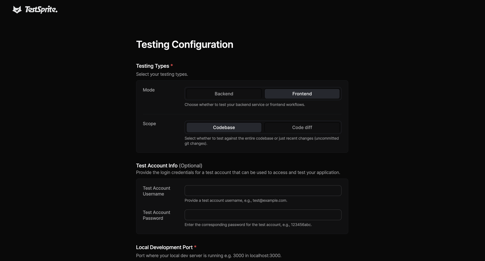
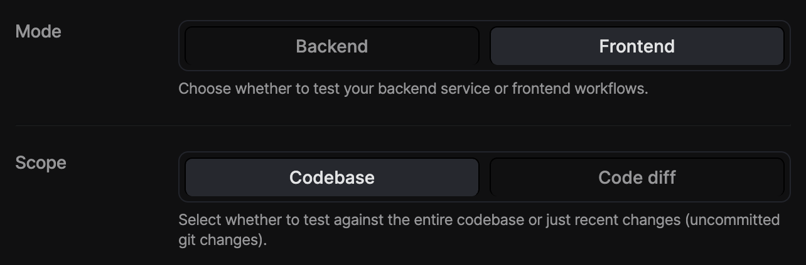
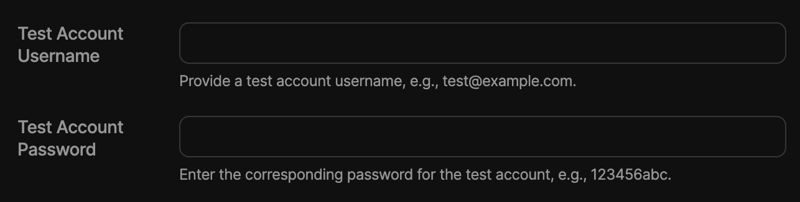
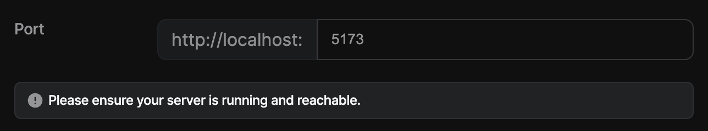
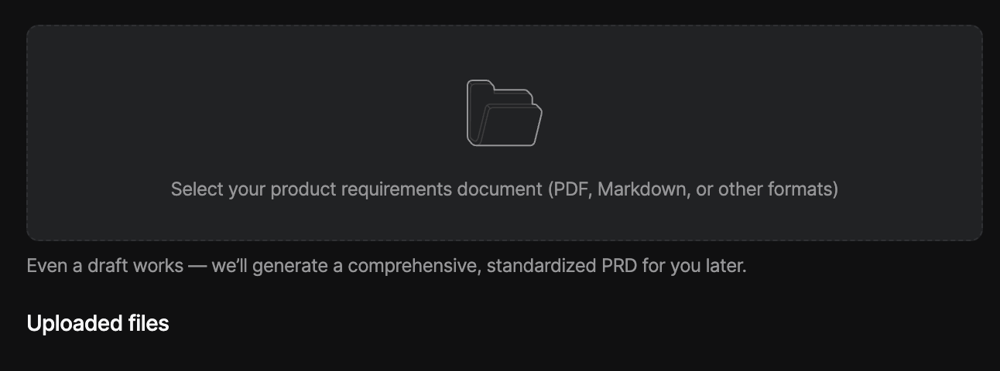

By the end of this guide, you'll have run your first **automated test suite**, seen AI generate comprehensive test plans, watched tests execute in the cloud, received detailed test reports, and applied **automatic bug fixes**.

<Info>
Before starting, ensure you have [TestSprite MCP Server installed](/mcp/installation) and **your IDE open**.
</Info>

## Step 1: Prepare Your Project

**Start Your Application** - Make sure your application is running locally:

```bash Example
# For frontend applications (examples)
npm run dev          # Usually runs on port 3000, 5173, or 8080
 
# For backend applications (examples)
node index.js        # Usually runs on port 8000, 3001, or 4000
```

``` text Project Structure Example
my-project/
├── frontend/          # React, Vue, Angular, etc.
│   ├── src/
│   ├── package.json
│   └── ...
├── backend/           # Node.js, Python, etc.
│   ├── app.py
│   ├── requirements.txt
│   └── ...
├── README.md
└── package.json
```

## Step 2: The Magic Command

Open **your IDE Chat** and follow these steps:
1. **Open** a new chat window in your IDE
2. **Type** the magic command:

```text icon="file-lines"
Can you test this project with TestSprite?
```

3. Drag and drop your project folder into the chat if you'd like to test a specific sub-project
4. Press  <kbd>⇧ Enter</kbd>

That's it! Your AI assistant will now take over and guide you through the entire testing process.

## Step 3: Configuration (Required)

  <Frame>
    
  </Frame>

  <Note>The Testing Configuration page will open in your browser. Complete the setup here to continue your test.</Note>

When the bootstrap tool opens, you must configure:

1. **Testing Type**
  <Frame>
    
  </Frame>
  <Tabs>
    <Tab title="Mode">
    - **Frontend**: Select this if you want to test your UI and user flows (e.g. buttons, forms, navigation).

    - **Backend**: Select this if you want to test your APIs, services, or server logic.
    </Tab>
    <Tab title="Scope">
    - **Codebase**: Runs tests against the entire project. Use this if you want a full test sweep or haven’t run MCP before.
    - **Code Diff**: Runs tests only against your recent changes (uncommitted Git changes). Use this to quickly validate new work without testing everything again.
    </Tab>
  </Tabs>


2. **Test Account Credentials** - If your app requires login:

<Tabs>
  <Tab title="Frontend">
    <Frame>
    
  </Frame>
  ```json Crediential Examples
    Username: test@example.com
    Password: your-test-password
    ```
  </Tab>
  <Tab title="Backend">
    <Frame>
    
  </Frame>
  
  <div className="full-width-table" style={{ display: 'grid', gridTemplateColumns: '1fr 2fr', gap: '0' }}>
    <div className="table-header" style={{ padding: '2px', fontSize: '14px' }}>Authentication Type</div>
    <div className="table-header" style={{ padding: '2px', fontSize: '14px' }}>Description</div>
    <div className="table-cell" style={{ padding: '2px', fontSize: '14px', borderBottom: '1px solid var(--table-border-color, #e5e7eb)' }}>**Basic**</div>
    <div className="table-cell" style={{ padding: '2px', fontSize: '14px', borderBottom: '1px solid var(--table-border-color, #e5e7eb)' }}>Uses username & password</div>
    <div className="table-cell" style={{ padding: '2px', fontSize: '14px', borderBottom: '1px solid var(--table-border-color, #e5e7eb)' }}>**Bearer**</div>
    <div className="table-cell" style={{ padding: '2px', fontSize: '14px', borderBottom: '1px solid var(--table-border-color, #e5e7eb)' }}>Secure token-based authentication</div>
    <div className="table-cell" style={{ padding: '2px', fontSize: '14px', borderBottom: '1px solid var(--table-border-color, #e5e7eb)' }}>**API-key**</div>
    <div className="table-cell" style={{ padding: '2px', fontSize: '14px', borderBottom: '1px solid var(--table-border-color, #e5e7eb)' }}>Uses a unique API key for access</div>
    <div className="table-cell" style={{ padding: '2px', fontSize: '14px' }}>**None**</div>
    <div className="table-cell" style={{ padding: '2px', fontSize: '14px' }}>No authentication required</div>
  </div>
  
  </Tab>
</Tabs>

3. **Application URLs:**

<Frame>
  
</Frame>
``` text URL Examples
Frontend: http://localhost:5173
Backend: http://localhost:4000
```

4. **Product Requirements Document** 

<Frame>
  
</Frame>

Upload existing PRD (required). Even a draft or low-quality PRD is fine. TestSprite AI will generate a normalized PRD based on your upload.

## Step 4: The Automated Workflow

Your AI assistant will automatically handle the **entire testing process** by running through these steps. It takes care of everything from understanding your project to running the actual tests, so you don't have to do any of the work manually.

Learn more about details steps at [Testing Workflow](/mcp/workflow).

## Step 5: Review Test Results

After testing, you'll find these files in your project:

``` text Expandable After Testing Project Structure Example
testsprite_tests/
├── tmp/
│   ├── prd_files/                 # Uploaded PRD files
│   ├── config.json               # Test configuration
│   ├── code_summary.json         # Code analysis
│   ├── report_prompt.json        # AI analysis data
│   └── test_results.json         # Detailed test results
├── standard_prd.json             # Normalized PRD
├── TestSprite_MCP_Test_Report.md # Human-readable report
├── TestSprite_MCP_Test_Report.html # HTML report
├── TC001_Login_Success_with_Valid_Credentials.py
├── TC002_Login_Failure_with_Invalid_Credentials.py
└── ...                           # Additional test files
```

**Understanding Test Results** - The test report shows overall coverage, pass rate, failed tests with detailed failure analysis, and categories (Functional, UI/UX, Security, Performance).

## Step 6: Automatic Bug Fixes

**Request Fixes** - After reviewing the test results, simply ask:

```text icon="file-lines"
Please fix the codebase based on TestSprite testing results.
```

The AI will analyze failing tests, identify problematic code sections, apply targeted fixes automatically, re-run tests to verify fixes, and iterate until issues are resolved.

## Example Output

**Test Plan Generated:**
```json Expandable Test Plan Example
{
  "testCases": [
    {
      "id": "TC001",
      "title": "User Authentication Login",
      "description": "Test user login with valid credentials",
      "category": "Functional",
      "priority": "High",
      "steps": [
        "Navigate to login page",
        "Enter valid username and password",
        "Click login button",
        "Verify successful login"
      ]
    }
    // ... 17 more test cases
  ]
}
```

**Test Report Summary:**
```json Expandable Test Report Summary Example
{
  "summary": {
    "totalTests": 18,
    "passed": 12,
    "failed": 6,
    "passRate": "67%",
    "coverage": "85%"
  },
  "failures": [
    {
      "testId": "TC005",
      "title": "Admin Panel Access",
      "error": "Button not found: #admin-delete-btn",
      "recommendation": "Add missing delete button in admin panel"
    }
  ]
}
```

## Tips for Success

<AccordionGroup>
  <Accordion title="Ensure Apps Are Running">
  Frontend and backend should be accessible on standard ports
  </Accordion>

  <Accordion title="Project Structure">
    Include README with setup instructions and descriptive folder names
  </Accordion>

  <Accordion title="Test Credentials">
    Prepare test user accounts with non-production data
  </Accordion>

   <Accordion title="Review Generated Files">
    Check the generated PRD and test plan for accuracy
  </Accordion>
</AccordionGroup>

## Next Steps

**Congratulations!** You've successfully run your first automated test with TestSprite MCP Server.

<Columns cols={2}>
  <Card title="Complete Testing Workflow" href="../mcp/workflow">
  Understand the full process
  </Card>
  <Card title="View Examples" href="../mcp/examples">
  See real-world use cases
  </Card>
  <Card title="Join Discord" arrow="true" href="https://discord.com/invite/GXWFjCe4an">
  Get help and share experiences
  </Card>
  <Card title="Contribute on Github" arrow="true" href="https://github.com/wangy44624/docs">
  Contribute and report issues
  </Card>
</Columns>