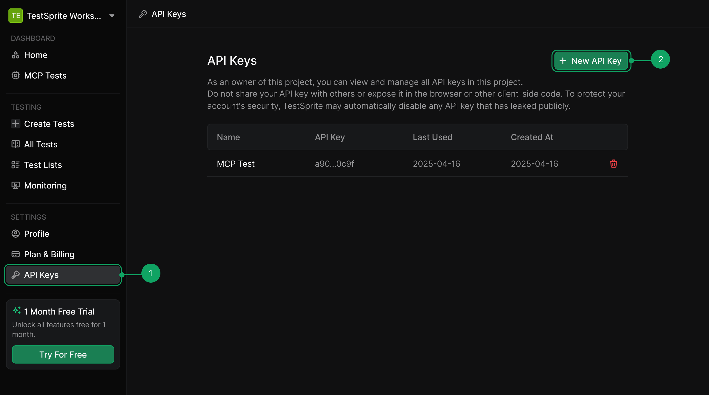
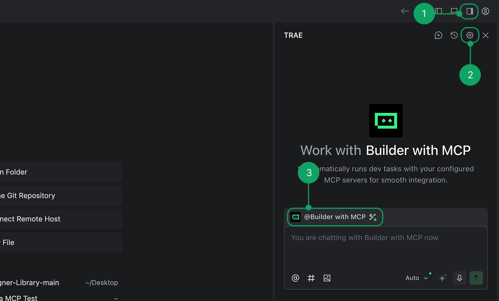

## Prerequisites

Before installing TestSprite MCP Server, ensure you have:

1. **Compatible IDEs**
2. **TestSprite Account** - [Sign up for free  <Icon icon="arrow-up-right-from-square" size={12} />](https://www.testsprite.com/auth/cognito/sign-up)
3. **Node.js >= 22** - [Download Node.js  <Icon icon="arrow-up-right-from-square" size={12} />](https://nodejs.org/) (required for running MCP server)

<AccordionGroup>
  <Accordion title="Which IDEs and editors does TestSprite support?">
    TestSprite supports **Trae**, **Cursor**, **Claude Code**, **Windsurf**, **VS Code**, and **GitHub Copilot**. Simply install our MCP Server get started.
  </Accordion>

  <Accordion title="How do I check my Node.js version?">
    Run `node --version` to check your version. For detailed setup instructions, see [Node.js Configuration](../troubleshooting//installation-issues#node-js-version-compatibility).
  </Accordion>
</AccordionGroup>


## Get Your API Key

First, you'll need a TestSprite API key for any installation method:

<Frame>
  
</Frame>


1. Sign in to your [TestSprite Dashboard  <Icon icon="arrow-up-right-from-square" size={12} />](https://www.testsprite.com/dashboard)
2. Navigate to **API Keys** under Settings
3. Click **"New API Key"**
4. **Copy** your API key (you'll need it for installation)

## One-Click installation

<Tabs>
<Tab title="Trae">

  <Frame>
    
  </Frame>

1. Get your [**API key**](#get-your-api-key). 
2. In Trae, navigate to `AI Sidebar > AI Management`.
3. Select `MCP > Add > Add from Marketplace`.
4. Search for **TestSprite** and add to your MCP list.
5. **Enter your API key** in Trae and hit **Confirm**
6. Select **Builder with MCP** and start testing.
</Tab>
<Tab title="Cursor">
The easiest way to install TestSprite MCP Server in Cursor:

1. Get your [**API key**](#get-your-api-key). 
2. Click this [one-click install link  <Icon icon="arrow-up-right-from-square" size={12} />](cursor://anysphere.cursor-deeplink/mcp/install?name=TestSprite&config=eyJjb21tYW5kIjoibnB4IEB0ZXN0c3ByaXRlL3Rlc3RzcHJpdGUtbWNwQGxhdGVzdCIsImVudiI6eyJBUElfS0VZIjoiIn19).
3. **Enter your API key** in Cursor.
4. Start testing.
</Tab>
</Tabs>

## Manual Installation

 Follow the instructions for your specific client to add the TestSprite MCP server.

<Tabs>
  <Tab title="Cursor">
     1. Open Cursor Settings ( <Tooltip tip="Cmd/Ctrl + Shift + J"><kbd>⌘⇧J</kbd></Tooltip> )
    2. Navigate to **Tools & Integration**
    3. Click **Add custom MCP**
    4. **Add** the following configuration:

    ```json icon="code" Cursor Configuration
    {
      "mcpServers": {
        "TestSprite": {
          "command": "npx",
          "args": ["@testsprite/testsprite-mcp@latest"],
          "env": {
            "API_KEY": "your-api-key"
          }
        }
      }
    }
    ```
    5. Check if the green dot shows up on the TestSprite MCP server icon, and the tools have been loaded successfully.
    <Frame>
      
    </Frame>
  </Tab>

  <Tab title="Claude Code">
    1. **Navigate to your project directory** in terminal:
       ```bash
       cd /path/to/your/project
       ```

    2. **Paste the installation command into your terminal**:
       ```bash
       claude mcp add TestSprite --env API_KEY=your_api_key -- npx @testsprite/testsprite-mcp@latest
       ```

    3. **Replace `your_api_key`** with your actual TestSprite API key
    4. **Run** the installation command
    5. **Verify the installation** by running this command in your project directory:
       ```bash
       claude mcp list
       ```
       
       You should see:
       ``` json Example Terminal Output
       TestSprite: npx @testsprite/testsprite-mcp@latest - ✓ Connected
       ```

       <Warning>Installing the MCP server this way adds TestSprite only to Claude Code under the **current project directory**. If you're using Claude Code in another project directory, you'll need to add the MCP server again. For installing the MCP server under different scopes (e.g. global), refer to the [Claude Code MCP documentation <Icon icon="arrow-up-right-from-square" size={12} />](https://docs.anthropic.com/en/docs/claude-code/mcp)</Warning>


  </Tab>

  <Tab title="VSCode">
    1. **Open** the Command Palette ( <Tooltip tip="Cmd/Ctrl + Shift + P"><kbd>⌘⇧P</kbd></Tooltip> )
    2. **Run** the **MCP: Add Server** command
    3. **Choose** Command (stdio) installation type
    4. **Type** `npx @testsprite/testsprite-mcp@latest` for Command to run
    5. **Type** TestSprite for the MCP server identifier/name
    6. **Choose** the scope where you want the MCP server to be configured
    7. **Add** the `env` configuration:

    ```json icon="code" VS Code Configuration
    {
      "mcpServers": {
        "TestSprite": {
          "command": "npx",
          "args": ["@testsprite/testsprite-mcp@latest"],
          "env": {
            "API_KEY": "your-api-key"
          }
        }
      }
    }
    ```
    8. After installation, click the `start` button above the TestSprite MCP entry in the `mcp.json` file you have just configured. If the server started with no errors and all the tools have been loaded, you have installed the MCP server successfully.
  </Tab>

  <Tab title="Other IDEs">
    Add this configuration to your MCP settings:

    ```json icon="code" Other IDE Configuration
    {
      "mcpServers": {
        "TestSprite": {
          "command": "npx",
          "args": ["@testsprite/testsprite-mcp@latest"],
          "env": {
            "API_KEY": "your-api-key"
          }
        }
      }
    }
    ```
  </Tab>
</Tabs>


## Installation Verification

### Success Indicators
- Your AI assistant can see **TestSprite MCP tools** 
- No **"command not found"** errors  
- Ready to start testing your projects  

### Quick Test
Try prompting:
```json icon="file-lines"
Help me test this project with TestSprite.
``` 
Your assistant should offer to use TestSprite MCP tools.

## Uninstallation

To remove TestSprite MCP Server:

1. **Remove the configuration** from your IDE's MCP settings
2. **Restart your IDE**