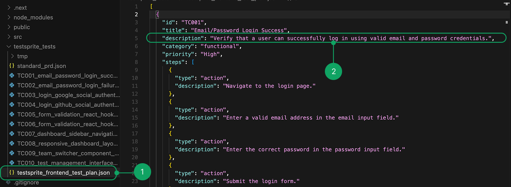
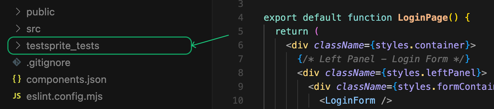
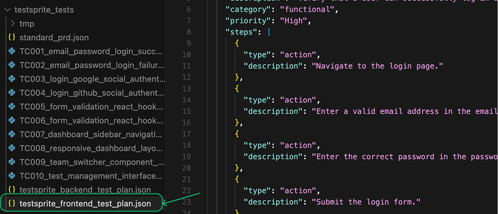

## Re-run Existing Tests

Sometimes you just want to re-run the same tests as the previous run—maybe to double-check after a bug fix.

<Tabs>
  <Tab title="Re-run All Tests">
    In your coding IDE, simply type:  

    ```text Example Prompt
    Help me rerun the testsprite_generate_code_and_execute tool.
    ```

    TestSprite will automatically detect your existing project test suite and execute all of the tests again. You'll see updated results directly in your IDE or TestSprite dashboard.
  </Tab>
  
  <Tab title="Re-run Subset of Tests">
    TestSprite gives you the flexibility to re-run only a subset of your tests instead of executing the entire suite. This is useful when you want to quickly validate specific scenarios without waiting for every test to finish.

    You can annotate the tests you want to re-run and pass their indexes directly to the `testsprite_generate_code_and_execute` command. For example, to re-run only the 1st, 3rd, and 12th tests:

    ```text Example Prompt
    Help me rerun the 1, 3 and 12th tests using testsprite_generate_code_and_execute
    ```
  </Tab>
</Tabs>


<Tip>
This is useful after you fix a bug or change code and want to confirm nothing is broken.
</Tip>

## Regenerate Tests

There are two different ways to regenerate tests depending on whether you want to update just a few cases or start over completely.

<Tabs>
  <Tab title="Regenerate Subset of Test Cases">
  <Frame>
    
  </Frame>
    1. Open your TestSprite test plan file (e.g. `testsprite_frontend_test_plan.json`).
    2. Find the test case you want to change and edit the description. For example:

    ```md Before/After Example
    Before: Verify user can log in with valid email and password
    After: Verify user can log in with email 'example@gmail.com', password 'xxxxxx'
    ```

    3. Save the file. ( <Tooltip tip="Cmd/Ctrl + S"><kbd>⌘S</kbd></Tooltip> )
    4. Prompt in your IDE:

    ```text Example Prompt
     Rerun the Xth test for me using testsprite_generate_code_and_execute
    ```

    5. TestSprite will detect your change, update the relevant test code, and run the updated tests automatically.

    <Info>
    **Key Point:** You only need to change the description in the plan. TestSprite handles the rest.
    </Info>
  </Tab>
  
  <Tab title="Regenerate Entire Project">
    If you want a clean start or have made major changes:
    <Frame>
    
    </Frame>

    1. Delete the `testsprite_tests` folder in your project.  

    <Info>
    This ensures no outdated files remain.
    </Info>

    2. In your IDE, type again:

    ```text Example Prompt
    Help me test this project with TestSprite
    ```

    3. TestSprite will generate a brand new test plan and test code for the whole project.

    <Warning>
    **When to use this:** If your project has changed a lot and the old test plan no longer matches well.
    </Warning>
  </Tab>
</Tabs>

## Add New Test Cases or Import From Other Platforms

Sometimes you'll want to extend your suite with fresh test cases.

  <Frame>
  
  </Frame>

1. Open the TestSprite test plan file. (e.g.`testsprite_frontend_test_plan.json`)
2. Append new test cases at the end, following the same format as the existing ones.
3. If you have test cases from another tool or platform, paste them in and make sure they follow the same style.
<Note>You can also use AI IDEs like Cursor or Trae to help reformat them to match TestSprite's standard.</Note>

For example:

```json Expandable Test Case Example
### New Test Case
{
  "id": "TC013",
  "title": "Admin Dashboard User and Category Management",
  "description": "Verify that admin users can create, edit, and delete categories and manage user roles and content moderation from the admin dashboard with immediate effect.",
  "category": "functional",
  "priority": "High",
  "steps": [
    {
      "type": "action",
      "description": "Login as admin user"
    },
    {
      "type": "action",
      "description": "Navigate to the admin dashboard"
    },
    {
      "type": "action",
      "description": "Create a new forum category"
    },
    {
      "type": "assertion",
      "description": "New category appears in the category list"
    },
    {
      "type": "action",
      "description": "Edit an existing category's name or description"
    },
    {
      "type": "assertion",
      "description": "Edits are saved and reflected in the UI"
    },
    {
      "type": "action",
      "description": "Delete a category"
    },
    {
      "type": "assertion",
      "description": "Category is removed and related threads are handled appropriately"
    },
    {
      "type": "action",
      "description": "Change a user's role from user to moderator"
    },
    {
      "type": "assertion",
      "description": "Role changes take effect immediately and permissions update"
    }
  ]
}
```

5. Once added, prompt your IDE:

```text Example Prompt
Rerun the xth test for me using testsprite_generate_code_and_execute
```

6. TestSprite will run the `generate_code_execute` tool again, generate test code for your new cases, and add them to your project and your TestSprite account.

## Summary

<div className="full-width-table" style={{ display: 'grid', gridTemplateColumns: '1fr 2fr', gap: '0' }}>
  <div className="table-header" style={{ padding: '8px', fontSize: '14px' }}>Action</div>
  <div className="table-header" style={{ padding: '8px', fontSize: '14px' }}>Description</div>
  <div className="table-cell" style={{ padding: '8px', fontSize: '14px', borderBottom: '1px solid var(--table-border-color, #e5e7eb)' }}>**Rerun**</div>
  <div className="table-cell" style={{ padding: '8px', fontSize: '14px', borderBottom: '1px solid var(--table-border-color, #e5e7eb)' }}>Quick re-execution of existing tests</div>
  <div className="table-cell" style={{ padding: '8px', fontSize: '14px', borderBottom: '1px solid var(--table-border-color, #e5e7eb)' }}>**Regenerate some**</div>
  <div className="table-cell" style={{ padding: '8px', fontSize: '14px', borderBottom: '1px solid var(--table-border-color, #e5e7eb)' }}>Edit specific test case descriptions  <Icon icon="arrow-right" size={12} /> prompt rerun</div>
  <div className="table-cell" style={{ padding: '8px', fontSize: '14px', borderBottom: '1px solid var(--table-border-color, #e5e7eb)' }}>**Regenerate all**</div>
  <div className="table-cell" style={{ padding: '8px', fontSize: '14px', borderBottom: '1px solid var(--table-border-color, #e5e7eb)' }}>Delete `testsprite_tests` folder  <Icon icon="arrow-right" size={12} /> prompt rerun project tests</div>
  <div className="table-cell" style={{ padding: '8px', fontSize: '14px' }}>**Add/import**</div>
  <div className="table-cell" style={{ padding: '8px', fontSize: '14px' }}>Append new cases in test plan  <Icon icon="arrow-right" size={12} /> rerun to generate code</div>
</div>

<Check>
With these simple steps, your TestSprite test suite will stay **up-to-date, flexible, and always aligned with your evolving project.**
</Check>
