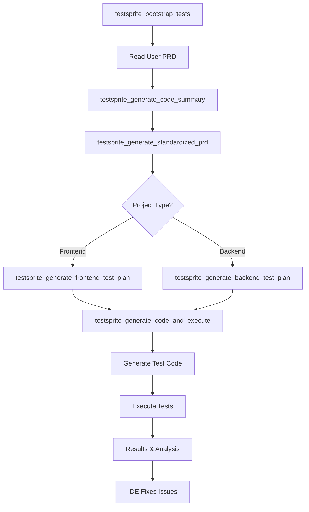

## Core Tools
TestSprite MCP Server provides **6 core tools** that work together to deliver comprehensive automated testing. Your AI assistant uses these tools automatically when you request testing.
<AccordionGroup>
  <Accordion title="testsprite_bootstrap_tests">
    **Purpose:** Initialize testing environment and configuration

    **Parameters:**
    - `localPort` (number): Port where your application is running (default: 5173)
    - `type` (string): Project type - "frontend" or "backend" 
    - `projectPath` (string): Absolute path to your project directory
    - `testScope` (string): Testing scope - "codebase" or "diff"

    **Usage:**
    ```javascript
    testsprite_bootstrap_tests({
      localPort: 3000,
      type: "frontend",
      projectPath: "/Users/dev/my-project",
      testScope: "codebase"
    })
    ```

    **Response:**
    The tool returns next_action instructions that guide the AI to:
    - Start your application if not running
    - Generate code summary automatically
    - Continue with the testing workflow

    **What it does:**
    - Detects project type and structure
    - Checks if application is running on specified port
    - Initializes testing configuration, whether it should test the entire codebase or just the code diffs
    - Opens TestSprite configuration portal
    - Automatically proceeds to code analysis
  </Accordion>

  <Accordion title="testsprite_generate_code_summary">
    **Purpose:** Analyze codebase and generate architectural summary

    **Parameters:**
    - `projectRootPath` (string): Absolute path to project root

    **Usage:**
    ```javascript
    testsprite_generate_code_summary({
      projectRootPath: "/Users/dev/my-project"
    })
    ```

    **Response:**
    The tool creates a `code_summary.json` file in your project containing:
    - Project architecture analysis
    - Framework and dependency detection
    - Feature mapping
    - Entry point identification

    **What it does:**
    - Scans entire project structure
    - Identifies technologies and frameworks
    - Analyzes code patterns and architecture
    - Generates comprehensive code summary file
    - Required for subsequent testing steps
  </Accordion>

  <Accordion title="testsprite_generate_standardized_prd">
    **Purpose:** Generate standardized Product Requirements Document

    **Parameters:**
    - `projectPath` (string): Absolute path to project root

    **Usage:**
    ```javascript
    testsprite_generate_standardized_prd({
      projectPath: "/Users/dev/my-project"
    })
    ```

    **Response:**
    Creates a `standard_prd.json` file containing:
    - Product overview and goals
    - User stories with acceptance criteria
    - Functional requirements
    - Technical specifications

    **What it does:**
    - Analyzes code to understand product functionality
    - Creates structured PRD document
    - Saves standardized format for test generation
    - Essential foundation for test planning
  </Accordion>

  <Accordion title="testsprite_generate_frontend_test_plan">
    **Purpose:** Generate comprehensive frontend test plan

    **Parameters:**
    - `projectPath` (string): Absolute path to project root
    - `needLogin` (boolean): Whether authentication is required (default: true)

    **Usage:**
    ```javascript
    testsprite_generate_frontend_test_plan({
      projectPath: "/Users/dev/my-project",
      needLogin: true
    })
    ```

    **Response:**
    Creates a `frontend_test_plan.json` file with:
    - UI interaction test cases
    - Form validation scenarios
    - Navigation and routing tests
    - Visual regression checks
    - Authentication flows (if needLogin is true)

    **What it does:**
    - Analyzes frontend components and features
    - Generates UI-specific test scenarios
    - Creates comprehensive test coverage plan
    - Automatically proceeds to test execution
  </Accordion>

  <Accordion title="testsprite_generate_backend_test_plan">
    **Purpose:** Generate comprehensive backend test plan

    **Parameters:**
    - `projectPath` (string): Absolute path to project root

    **Usage:**
    ```javascript
    testsprite_generate_backend_test_plan({
      projectPath: "/Users/dev/my-project"
    })
    ```

    **Response:**
    Creates a `backend_test_plan.json` file with:
    - API endpoint testing
    - Functional integration testing
    - Database operation tests
    - Authentication and authorization
    - Error handling scenarios

    **What it does:**
    - Analyzes backend APIs and services
    - Generates comprehensive API test scenarios
    - Creates database and integration tests
    - Handles authentication configurations
    - Automatically proceeds to test execution
  </Accordion>

  <Accordion title="testsprite_generate_code_and_execute">
    **Purpose:** Generate and execute comprehensive test suite

    **Parameters:**
    - `projectName` (string): Name of the project (typically the root directory name)
    - `projectPath` (string): Absolute path to project root
    - `testIds` (array): Specific test IDs to run (default: [] - runs all tests)
    - `additionalInstruction` (string): Additional testing instructions (default: "")

    **Usage:**
    ```javascript
    testsprite_generate_code_and_execute({
      projectName: "my-ecommerce-app",
      projectPath: "/Users/dev/my-project",
      testIds: [], // Run all tests
      additionalInstruction: "Focus on checkout flow and payment security"
    })
    ```

    **Response:**
    Executes tests and creates:
    - Individual test files for each test case
    - Test execution results
    - Bug reports and fix recommendations
    - `testsprite_tests/tmp/test_results.json` with comprehensive results
    - `tmp/report_prompt.json` for AI analysis
    - `TestSprite_MCP_Test_Report.md` - human-readable test report
    - `TestSprite_MCP_Test_Report.html` - HTML test report

    **What it does:**
    - Generates actual test code (Playwright, Cypress, etc.)
    - Executes tests against your running application
    - Provides detailed results with screenshots/videos
    - Identifies bugs and suggests fixes
    - Creates comprehensive test reports
  </Accordion>
</AccordionGroup>

## Tool Chain Workflow

The tools work together in a specific sequence following the complete TestSprite workflow:

<Card>

</Card>

## File Structure

After running the tools, your project will have:

```text Expandable File Structure
my-project/
├── testsprite_tests/
│   ├── tmp/
│   │   ├── prd_files/              # Temporary PRD files
│   │   ├── config.json             # Project configuration
│   │   ├── code_summary.json       # Code analysis
│   │   ├── report_prompt.json      # AI analysis data
│   │   └── test_results.json       # Execution results
│   ├── standard_prd.json           # Product requirements
│   ├── TestSprite_MCP_Test_Report.md     # Human-readable test report
│   ├── TestSprite_MCP_Test_Report.html   # HTML test report
│   ├── TC001_Login_Success_with_Valid_Credentials.py
│   ├── TC002_Login_Failure_with_Invalid_Credentials.py
│   ├── TC003_Product_Catalog_Display.py
│   ├── TC004_View_Product_Details.py
│   ├── TC005_Purchase_Product_Success.py
│   ├── TC006_Purchase_Product_Failure.py
│   ├── TC007_Order_History_Accessibility.py
│   ├── TC008_Admin_Panel_Access_Control.py
│   └── ...                         # Additional test files
└── ...
```

### Error Handling
Tools provide comprehensive error handling:

```json
{
  "next_action": [
    "The project is not running on port 3000. Please start the project.",
    "Look for the start script in package.json or other files.",
    {
      "type": "tool_use", 
      "tool": "mcp_testsprite_testsprite_generate_code_summary"
    }
  ]
}
```

## Best Practices

<AccordionGroup>
  <Accordion title="Ensure Application is Running">
    The bootstrap tool checks if your app is running on the specified port
  </Accordion>
  
  <Accordion title="Use Absolute Paths">
    Always provide full absolute paths for `projectPath`
  </Accordion>
  
  <Accordion title="Authentication Setup">
    Provide login or authentication credentials in the TestSprite configuration portal for testing workflows
  </Accordion>
  
  <Accordion title="Incremental Testing">
    Use `testIds` parameter to run specific test cases
  </Accordion>
  
  <Accordion title="Additional Instructions">
    Provide context-specific instructions for better test generation
  </Accordion>
</AccordionGroup>

## Common Workflows

<Tabs>
  <Tab title="Full Testing Workflow">
    Simply prompt your AI assistant:
    ```text
    "Help you test this project with TestSprite"
    ```
    The AI will automatically:

    1. Bootstrap the testing environment
    2. Analyze your codebase
    3. Generate comprehensive test plans
    4. Execute all tests
    5. Provide results and fix recommendations
  </Tab>
  
  <Tab title="Targeted Testing">
  For specific test cases:
    ```text
    "Run tests TC001 and TC002 with focus on security"
    ```
    The AI will call:
    ```bash
    testsprite_generate_code_and_execute ({
      projectName: "my-project",
      projectPath: "/path/to/project",
      testIds: ["TC001", "TC002"],
      additionalInstruction: "Focus on security vulnerabilities"
    })
    ```
  </Tab>
</Tabs>

## Next Steps

Now that you understand the MCP tools reference, here's what to do next:


<CardGroup cols={2}>
  <Card title="Quick Start Guide" href="../get-started/Quick Start">
    Get up and running in minutes
  </Card>
  
  <Card title="Testing Workflow" href="../mcp/workflow">
    Understand the complete process
  </Card>
  
  <Card title="Troubleshooting" href="../troubleshooting/installation-issues">
    Common issues and solutions
  </Card>
  
  <Card title="Examples" href="../mcp/examples">
    See TestSprite in action with real examples
  </Card>
</CardGroup>
