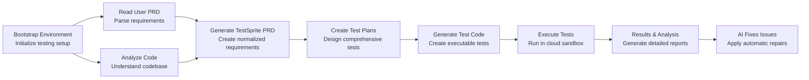

## Overview

TestSprite MCP Server follows a systematic 8-step workflow that transforms your code into thoroughly tested, production-ready software:

<Card>

</Card>

## Step 1: Bootstrap Testing Environment

The AI calls `testsprite_bootstrap_tests` to initialize the testing environment.

**Process:**
1. **Project Detection** - Identifies project type (`frontend` or `backend`)
2. **Port Discovery** - Finds running applications and their ports
3. **Configuration Portal** - Opens TestSprite configuration interface
4. **Scope Definition** - Determines testing scope (`codebase` or `diff`)

**Configuration Options:**
```json Sample Configuration
{
  "projectType": "frontend",
  "localPort": 5173,
  "testScope": "codebase",
  "needLogin": true,
  "credentials": {
    "username": "test@example.com",
    "password": "testpassword123"
  }
}
```

## Step 2: Read User PRD

TestSprite reads the Product Requirements Document (PRD) that you upload to understand your product goals and requirements.

**Process:**
1. **PRD Upload** - Reads the PRD file you uploaded during configuration
2. **Requirement Parsing** - Extracts user stories, acceptance criteria, and functional requirements
3. **Goal Understanding** - Identifies primary product objectives and user needs
4. **Scope Definition** - Determines what features should be tested

## Step 3: Code Analysis & Summary

The AI calls `testsprite_generate_code_summary` to analyze your codebase.

**Analysis Process:**
1. **Structure Mapping** - Identifies files, folders, and dependencies
2. **Framework Detection** - Recognizes React, Vue, Angular, Node.js, etc.
3. **Feature Extraction** - Understands implemented functionality
4. **Architecture Analysis** - Maps component relationships
5. **Security Assessment** - Identifies potential vulnerabilities

**Generated Output:**
```json Expandable Sample Output
{
  "tech_stack": [
    "React",
    "TypeScript", 
    "Material-UI (MUI)",
    "React Router",
    "Vite",
    "Node.js"
  ],
  "features": [
    {
      "name": "Authentication System",
      "description": "User login/logout functionality with protected routes and authentication context",
      "files": ["src/App.tsx", "src/pages/Login.tsx"]
    },
    {
      "name": "Product Catalog",
      "description": "Display products in a grid layout with filtering, search, and product browsing capabilities",
      "files": ["src/pages/ProductCatalog.tsx"]
    }
    // ... more app features
  ]
}
```

## Step 4: Generate TestSprite Normalized PRD

The AI calls `testsprite_generate_standardized_prd` to create a standardized, normalized Product Requirements Document based on the user PRD and code analysis.

### TestSprite Innovation
<Tip>**TestSprite invented this normalized PRD format** - a standardized structure that ensures consistent test generation across any project type, regardless of your original PRD format.</Tip>


**PRD Components:**
1. **Product Overview** - High-level description and goals
2. **Core Goals** - Primary objectives and user needs
3. **Key Features** - Main functionality and capabilities
4. **User Flows** - Step-by-step user journeys
5. **Validation Criteria** - Test requirements and acceptance criteria

**Generated PRD Structure:**
```json Expandable Sample Output
{
  "meta": {
    "project": "Your Application Name",
    "version": "1.0.0",
    "prepared_by": "Generated by TestSprite"
  },
  "product_overview": "High-level description of your application's purpose and functionality.",
  "core_goals": [
    "Primary objective of your application",
    "Key user needs the application addresses",
    "Main business or functional goals"
  ],
  "key_features": [
    "Core feature 1 with implementation approach",
    "Authentication and authorization system",
    "Main user interface components",
    "Data management and persistence"
  ],
  "user_flow_summary": [
    "User entry point and initial interaction",
    "Primary user workflows and actions",
    "Administrative and management functions"
  ],
  "validation_criteria": [
    "Functional requirements validation",
    "Security and access control verification", 
    "User interface and experience validation"
  ],
  "code_summary": {
    "tech_stack": ["Framework", "Language", "Tools"],
    "features": [
      {
        "name": "Feature Name",
        "description": "Feature functionality description",
        "files": ["src/components/Feature.tsx"]
      }
    ]
  }
}
```

## Step 5: Create Test Plans

The AI calls `testsprite_generate_frontend_test_plan` or `testsprite_generate_backend_test_plan` based on project type, using the normalized PRD and code analysis.

**Test Plan Components:**
1. **Test Cases** - Detailed scenarios with steps
2. **Categories** - Functional, UI/UX, Security, Performance
3. **Priorities** - High, Medium, Low based on user impact
4. **Prerequisites** - Setup requirements for each test
5. **Expected Results** - Success criteria and validation points

**Generated Test Plan:**
```json Expandable Sample Output
[
  {
    "id": "TC001",
    "title": "Login success with valid test credentials",
    "description": "Verify that users can log in successfully using the hardcoded test credentials",
    "category": "functional",
    "priority": "High",
    "steps": [
      {
        "type": "action",
        "description": "Navigate to the login page"
      },
      {
        "type": "action",
        "description": "Input valid hardcoded username"
      },
      {
        "type": "action",
        "description": "Input valid hardcoded password"
      },
      {
        "type": "action",
        "description": "Click the login button"
      },
      {
        "type": "assertion",
        "description": "Verify the user is redirected to the product catalog page"
      },
      {
        "type": "assertion",
        "description": "Verify authentication context reflects logged-in status"
      }
    ]
  }
  // ... more test cases covering functional, error handling, security, and ui categories
]
```

## Step 6: Generate Executable Test Code

The AI calls `testsprite_generate_code_and_execute` to create production-ready test code based on the test plans.

**Test Code Generation Process:**
1. **Framework Selection** - Chooses appropriate testing framework (Playwright, Cypress, Jest)
2. **Test Structure** - Creates organized test suites and files
3. **Helper Functions** - Generates reusable utility functions
4. **Data Setup** - Creates test data and fixtures
5. **Configuration** - Sets up test environment configuration

**Generated Test Code Examples:**

```python Expandable Sample Output
# TC001_Login_success_with_valid_test_credentials.py
import asyncio
from playwright import async_api

async def run_test():
    pw = None
    browser = None
    context = None
    
    try:
        # Start a Playwright session in asynchronous mode
        pw = await async_api.async_playwright().start()
        
        # Launch a Chromium browser in headless mode with custom arguments
        browser = await pw.chromium.launch(
            headless=True,
            args=[
                "--window-size=1280,720",
                "--disable-dev-shm-usage",
                "--ipc=host",
                "--single-process"
            ],
        )
        
        # Create a new browser context
        context = await browser.new_context()
        context.set_default_timeout(5000)
        
        # Open a new page in the browser context
        page = await context.new_page()
        
        # Navigate to your target URL
        await page.goto("http://localhost:5174", wait_until="commit", timeout=10000)
        
        # Navigate to the login page by clicking the login link
        frame = context.pages[-1]
        elem = frame.locator('xpath=html/body/div/header/div/a[3]').nth(0)
        await page.wait_for_timeout(3000); await elem.click(timeout=5000)
# ... more code
```

## Step 7: Execute Tests

TestSprite runs the generated test code in secure cloud environments.

**Cloud Execution Process:**
1. **Sandbox Creation** - Isolated testing environment
2. **Dependency Installation** - Installs required packages
3. **Test Execution** - Runs all generated tests
4. **Result Collection** - Gathers results, screenshots, logs
5. **Report Generation** - Creates comprehensive test report

## Step 8: Provide Results & Analysis

TestSprite generates comprehensive test reports with detailed analysis, error descriptions, and actionable fix recommendations. This report helps you understand exactly what passed, what failed, and how to fix the issues.

**What You Get:**
- **Detailed test results** with pass/fail status for each test case
- **Error analysis** explaining why tests failed
- **Fix recommendations** with specific steps to resolve issues
- **Coverage metrics** showing overall project health
- **Requirement breakdown** organized by feature areas

**Test Report Structure** 

After running tests, TestSprite creates a detailed report showing exactly what worked and what needs fixing.

<Accordion title="View Detailed Report Structure">
  **Basic Information** - Every report starts with essential details:
  - **Project Name** - The name of your application  
  - **Test Date** - When the tests were run
  - **Version** - Which version was tested
  - **Summary** - Quick overview of results

  **Test Results by Feature** - The report groups tests by your app's main features. Each feature section shows:

  **Feature Overview:**
  - **What it does** - Simple description of the feature
  - **How many tests** - Number of tests run for this feature

  **Each Test Shows:**
  - **Test ID** - Unique identifier like "TC001"
  - **What was tested** - Clear description like "Login with valid password"
  - **Result** - <span className="material-icons" style={{ color: '#4caf50', fontSize: '16px' }}>check_circle</span> **Passed** or <span className="material-icons" style={{ color: '#f44336', fontSize: '16px' }}>cancel</span> **Failed**
  - **Priority** - High, Medium, or Low importance
  - **What went wrong** - Detailed error explanation (if failed)
  - **How to fix it** - Specific recommendations for repairs

  **Overall Results Summary:**

  **Quick Stats:**
  - **73% of features tested** - How much of your app was covered
  - **56% of tests passed** - Overall success rate  
  - **Critical issues found** - Most important problems to fix

  **Feature-by-Feature Breakdown:**

  | Feature Area | Tests Run | <span className="material-icons">check_circle</span> Passed | <span className="material-icons">cancel</span> Failed |
  |--------------|-----------|------------|-----------|
  | User Login | 2 | 1 | 1 |
  | Product Display | 2 | 2 | 0 |
  | Admin Panel | 3 | 0 | 3 |
  | Shopping Cart | 3 | 3 | 0 |
</Accordion>

## Step 9: AI Fixes Issues Based on Report

When you request fixes with **"Help me fix the codebase based on these test results"**, your IDE AI assistant:

1. **Reads Test Results** - Reviews `testsprite_tests/tmp/test_results.json` for detailed failure data
2. **Analyzes Test Report** - Processes `testsprite_tests/tmp/report_prompt.json` for context and recommendations
3. **Examines Error Details** - Reviews stderr messages and test visualizations
4. **Identifies Root Causes** - Determines underlying issues causing test failures
5. **Generates Targeted Fixes** - Creates code changes based on TestSprite's recommendations
6. **Applies Changes** - Modifies your codebase automatically
7. **Validates Fixes** - Re-runs tests to verify solutions

<Tip>**TestSprite's Role** - TestSprite provides the analysis and recommendations, while your IDE's AI assistant implements the actual fixes.</Tip>

**Example Fix Application:**
```javascript Expandable Sample Output
// Before (failing test)
// Missing delete button in admin panel

// After (AI-generated fix)
const AdminProductCard = ({ product, onDelete }) => {
  return (
    <div className="product-card">
      <h3>{product.name}</h3>
      <p>{product.description}</p>
      <div className="actions">
        <button className="edit-btn">Edit</button>
        {/* AI added this button to fix failing test */}
        <button 
          id="admin-delete-btn"
          className="delete-btn"
          onClick={() => onDelete(product.id)}
        >
          Delete
        </button>
      </div>
    </div>
  );
};
```

## Workflow Optimization Tips

<AccordionGroup>
  <Accordion title="Before Testing">
    - Ensure all applications are running  
    - Prepare test credentials  
    - Update README with project description  
    - Clean up any development artifacts
  </Accordion>

  <Accordion title="During Testing">
    - Review generated PRD for accuracy  
    - Examine test plan coverage  
    - Monitor test execution progress  
    - Note any configuration adjustments needed
  </Accordion>

  <Accordion title="After Testing">
    - Analyze test results thoroughly  
    - Understand failure patterns  
    - Apply fixes systematically  
    - Document lessons learned
  </Accordion>
</AccordionGroup>

## Next Steps

Now that you understand the complete workflow, explore:

<Columns cols={2}>
  <Card title="MCP Tools Reference" href="/mcp/tools">
  Deep dive into available tools
  </Card>
  <Card title="View Examples" href="/mcp/examples">
  See real-world implementations
  </Card>
  <Card title="Troubleshooting" href="/mcp/troubleshooting">
  Solve common issues
  </Card>
</Columns>